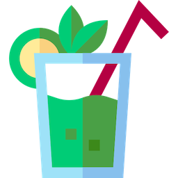

## MasterCocktail

## Простое приложение, которое помогает пользователю найти интересующий его коктейль. Работает с TheCocktailDb API.

## Стек:
- Kotlin 1.7.x
- Kotlin Coroutines
- Kotlin Flow
- Clean + MVVM;
- Jetpack: Navigation, ViewModel, LiveData, View Binding, Room
- Retrofit2;
- Room;
- Gson;
- Glide;
- OkHttpClient
- Hilt
- Firebase
- Coroutines

 

    
    
    
    
    

