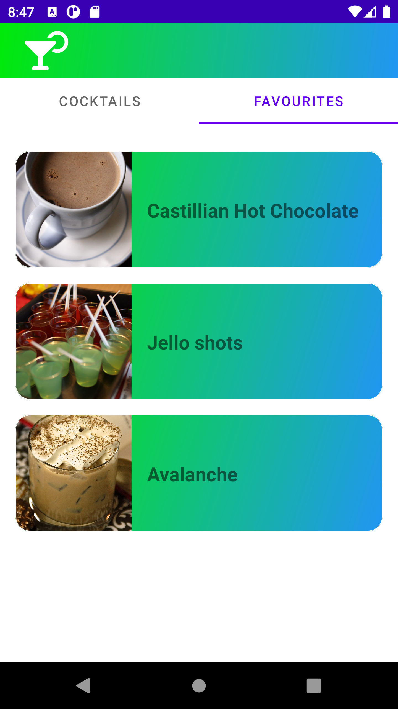
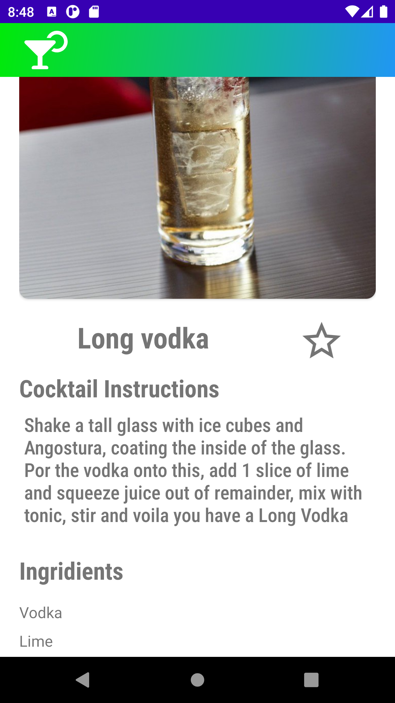
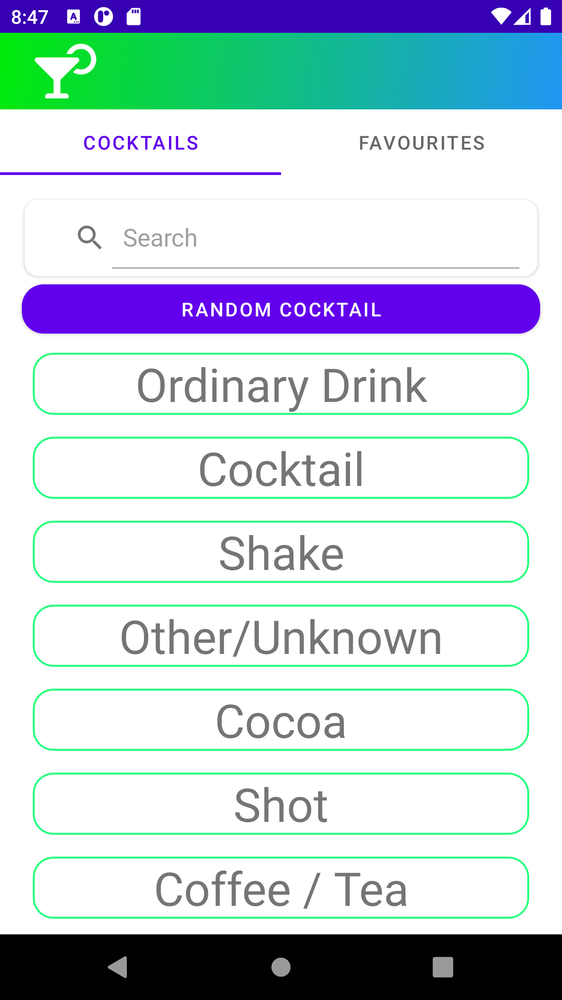
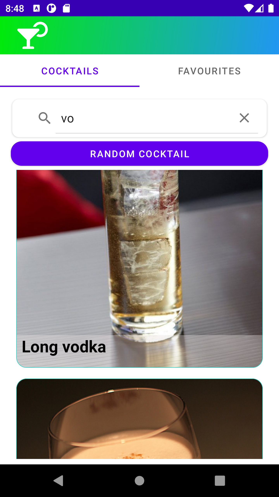

Нужно реализовать простое приложение, которое помогает пользователю найти интересующий его коктейль. Работать данное приложение должно с TheCocktailDb API.

Использует фрагменты для отображения списка и изображения Стек

- Kotlin;
- Clean + MVVM;
- Navigation Component;
- Retrofit2;
- SQLite;
- Room;
- Gson;
- Glide;
- OkHttpClient
- Hilt
- Firebase
- Coroutines
- Flow

     

     

     

     

